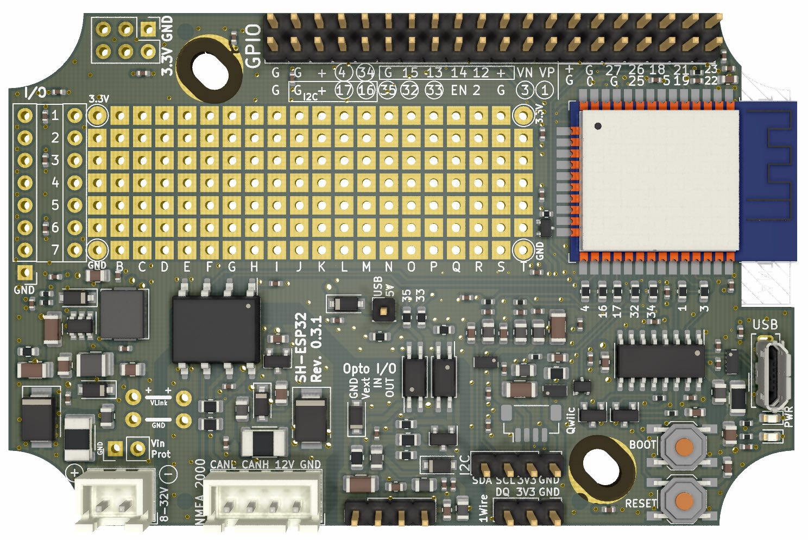
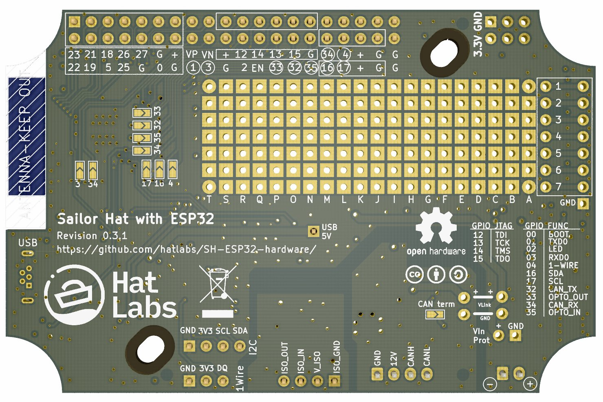

# Sailor Hat for ESP32

This repository contains the Sailor Hat for ESP32 (SH-ESP32) hardware design. SH-ESP32 is a powerful microcontroller development board designed for marine environments.

Special emphasis has been placed on electrical compliance: the board can handle most power surges ever present on an automotive or marine 12V or 24V power system. Equally importantly, the inputs and outputs have protection for electrostatic discharges (static electricity), and are designed to not produce electromagnetic emissions (disturb other sensitive devices such as VHF radios or GPS antennas), and to be protected against electromagnetic interference (will not be disturbed by a VHF, SSB, or a radar).

SH-ESP32 can be used to easily create different types of sensors and control devices for boats. Use scenarios include:

- RPM sensors
- tank level sensors
- bilge sensors
- temperature and humidity sensors
- relay controls (lights, blowers, anchor winch)
- Attitude sensors
- Electronic compasses
- NMEA 2000 gateways
- NMEA 0183 gateways

Some of these applications require a small amount of additional components. Simple add-on boards and designs for these will be made available.

Since the board has native WiFi and NMEA 2000 compatible CAN bus connectivity, it can be used to create boards with either Signal K or native NMEA 2000 connectivity (or both!).

## Features

The main design features include:

- Built around ESP32, a powerful 32-bit microcontroller with 4 MB of flash
- Wide-range 8-32 V power input with surge protection (2-pin pluggable terminal block screw connector)
- NMEA 2000 compatible optoisolated CAN interface (4-pin pluggable terminal block screw connector)
- One optoisolated input and output (4-pin 2.54 mm header)
- 1-Wire interface (3-pin 2.54 mm header)
- I2C interface with both a SparkFun Qwiic connector and a 4-pin 2.54 mm header
- USB interface for programming and serial communication (USB Micro B)
- Provisions for wired Ethernet connectivity with an optional add-on board
- All above interfaces with proper electromagnetic compatibilty (EMC) design -- the device won't interfere with navigational devices or radio equipment
- All interfaces can be disabled or rerouted to different pins
- All general-purpose input/output (GPIO) pins broken out to a separate header
- Through-plated perf board area for custom additions
- Board designed to fit standard low-cost waterproof 100x68x50 mm enclosures

Rendering of a rev 0.3.1 board:

Front side.

Back side.

## Getting SH-ESP32

SH-ESP32 is available for purchase at the [Hat Labs web store](https://hatlabs.fi/).

## Documentation

SH-ESP32 documentation is available at the [project GitHub Pages](https://hatlabs.github.io/sh-esp32/).